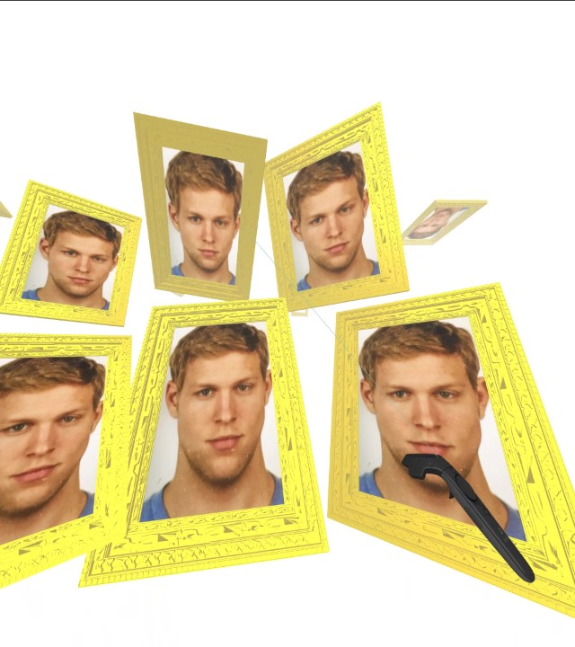
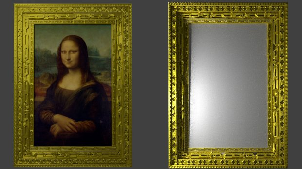
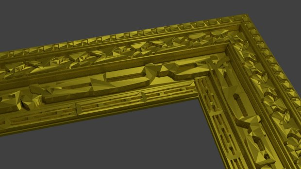

# <p align="center">🔥 TinderVR</p>

## <p align="center">A Spatial Tinder Implementation</p>

### <p align="center">An endless white space is constantly being filled with human recommendations falling from the sky.</p>

- There is a white room.
- Tinder cards are falling from the ceiling.
- It never stops.

- Once a human being is there you can not throw it away it will always remain in that white room with you
- 

<p align="center">

</p>

## <p align="center">Usage</p>

config.js
```script
{
    "facebook" : {
        "username" : "",
        "password" : ""
    }
}

```

## <p align="center">Assets</p>

NOTE!
https://www.turbosquid.com/Search/3D-Models/tinder




https://free3d.com/3d-model/frame-75994.html

https://free3d.com/3d-model/picture-frame-collection-5269.html

## <p align="center">Usage</p>

- Grab/Tell fall
- 
